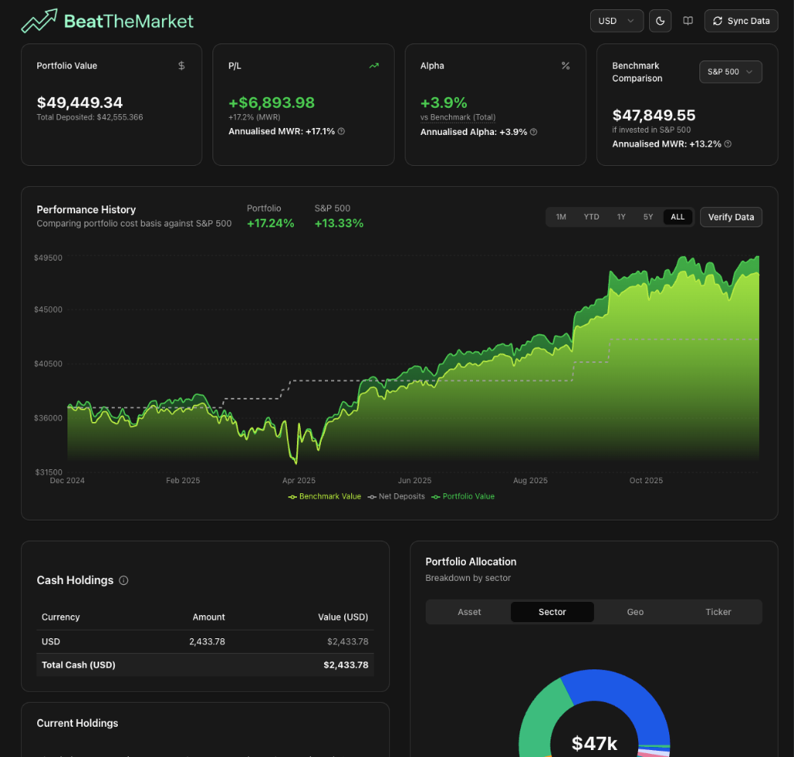

# BeatTheMarket

<div align="center">
  
  <p><em>Stop guessing. Start measuring. True portfolio alpha tracking for Interactive Brokers users.</em></p>
  <p><strong><a href="https://beat-the-market-ten.vercel.app/">View Live Demo / Use App</a></strong></p>
</div>

<div align="center">
  <p>
    <a href="#key-features">Key Features</a> •
    <a href="#why-beatthemarket">Why BeatTheMarket</a> •
    <a href="#how-it-works">How It Works</a> •
    <a href="#future-roadmap">Roadmap</a> •
    <a href="#getting-started">Getting Started</a>
  </p>
</div>

---

## Overview

<div align="center">
  
</div>

<br />

## Why BeatTheMarket?

Most brokerage platforms (including Interactive Brokers) are great at executing trades but terrible at showing you your **true performance**.

1.  **The "Deposits = Profit" Fallacy**: Many simple trackers confuse a fresh deposit with investment gain.
2.  **Time-Weighted vs. Money-Weighted**: Brokers often show TWR (Time-Weighted Return), which is great for fund managers but irrelevant for individuals who control *when* they deploy cash. If you buy the dip and the market rallies, your personal return (MWR) is higher than the fund's return. **BeatTheMarket calculates your true Money-Weighted Return.**
3.  **The "Ghost Portfolio" Benchmark**: It's easy to say "I'm up 10% this year". But if the S&P 500 is up 15%, you effectively *lost* money by picking stocks. BeatTheMarket creates a **Ghost Portfolio** that simulates "What if I had invested every single dollar of my deposits into the S&P 500 (or other benchmark) on the exact same day I deposited it?" This is the only way to measure true **Alpha**.

## Key Features

- **True MWR Calculation**: Uses the **Modified Dietz** method and **XIRR** to calculate your exact personal performance, accounting for the timing and size of every deposit and withdrawal.
- **"Ghost" Benchmarking**: Compares your portfolio against a simulated benchmark strategy (e.g., S&P 500, Nasdaq, World Index) using identical cash flows.
- **Privacy First**: All data processing happens **locally in your browser**. Your financial data (IBKR Flex Queries) is parsed client-side. No sensitive portfolio data is stored on our servers.
- **Deep Diversification Analysis**:
    - **Sector Breakdown**: See your exposure to Tech, Healthcare, etc.
    - **Geographic Breakdown**: Visualise your global exposure.
    - **Asset Class**: Equity, Cash, Options, etc.
- **Multi-Currency Logic**: Automatically normalises all positions and transactions from their native currency (EUR, GBP, SGD, etc.) to your portfolio base currency (USD).

## How It Works

BeatTheMarket is capable of ingesting data directly from **Interactive Brokers** via **Flex Queries**.

1.  **Ingestion**: You generate a specific XML Flex Query in IBKR (containing Cash Transactions and Open Positions).
2.  **Parsing (Client-Side)**: The app parses complex XML structures, handling spin-offs, dividends, tax withholding, and currency conversions.
3.  **Math Engine**:
    -   We aggregate strictly by **Cash Flows** (Net Deposits). 
    -   **Daily Valuation**: We interpolate portfolio values between data points to generate smooth charts.
    -   **Alpha Generation**: `Alpha = Portfolio MWR - Benchmark MWR`.
4.  **Tech Stack**:
    -   **Framework**: Next.js 16 (App Router)
    -   **UI**: React 19, Tailwind CSS 4, Shadcn/UI (Radix Primitives)
    -   **Charts**: Recharts
    -   **State Management**: Zustand
    -   **Math**: `xirr` library + custom financial calculation engine.

## Future Roadmap

We are constantly improving BeatTheMarket to make it the ultimate retail investor dashboard.

### Currency Support
- Start support for base currencies other than USD (e.g., **SGD**, **EUR**, **GBP**) for users who want to view their net worth in their home currency.

### Enhanced Benchmarking
- Support for more indexes beyond S&P 500 (e.g., **Nasdaq 100**, **FTSE All-World**, **STI ETF**).
- Custom ETF benchmarking (pick any ticker as your benchmark).

### Extended Broker Support
We plan to add parsers for other popular retail brokers:
- **Tiger Brokers**
- **Moomoo**
- **Syfe**
- **Webull**

### Fundamental Analysis Overlay
- **Financial Health**: View fundamental metrics for your holdings directly in the dashboard.
    - **P/E Ratio**
    - **Free Cash Flow**
    - **EPS Growth**
- **Earnings Calendar**: See upcoming earnings interaction for your portfolio.

## Getting Started

### Use the Hosted App
The easiest way to use BeatTheMarket is to visit our live deployment:
👉 **[beat-the-market-ten.vercel.app](https://beat-the-market-ten.vercel.app/)**

### Run Locally
If you prefer to run the code yourself:

1.  **Clone the repository**
    ```bash
    git clone https://github.com/yourusername/BeatTheMarket.git
    ```
2.  **Install dependencies**
    ```bash
    npm install
    ```
3.  **Run the development server**
    ```bash
    npm run dev
    ```
4.  **Open your browser**
    Navigate to [http://localhost:3000](http://localhost:3000)

---
*Built with ❤️ for investors who care about the numbers.*
