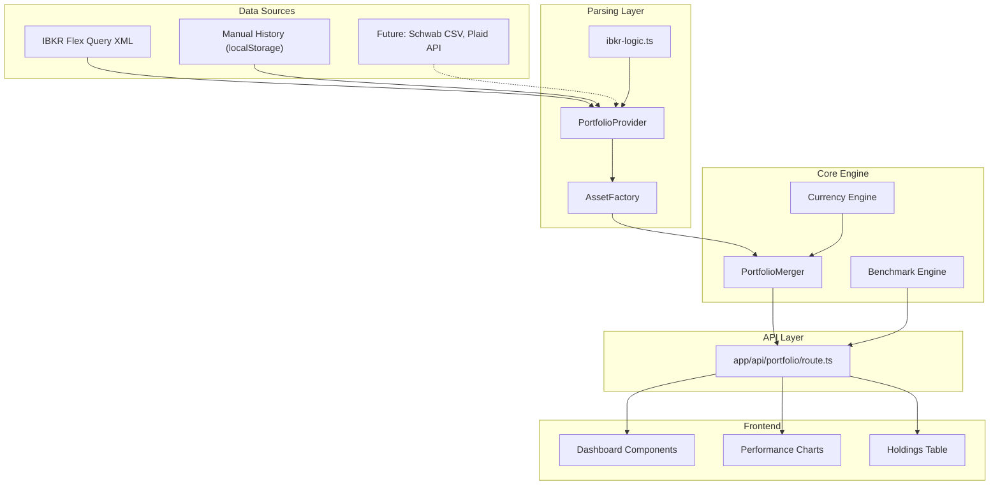
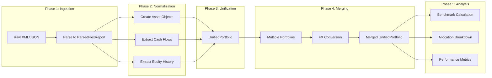
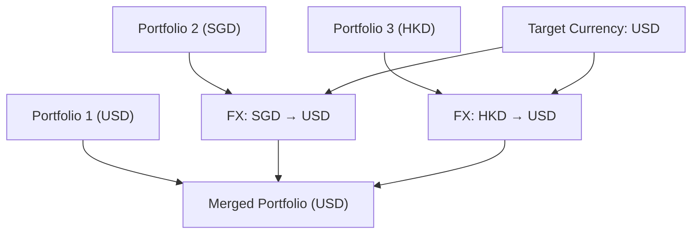
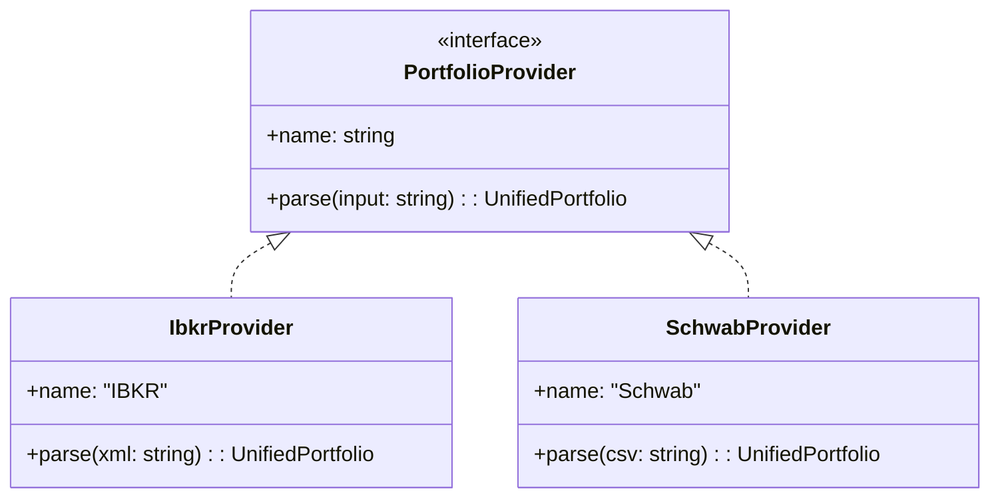
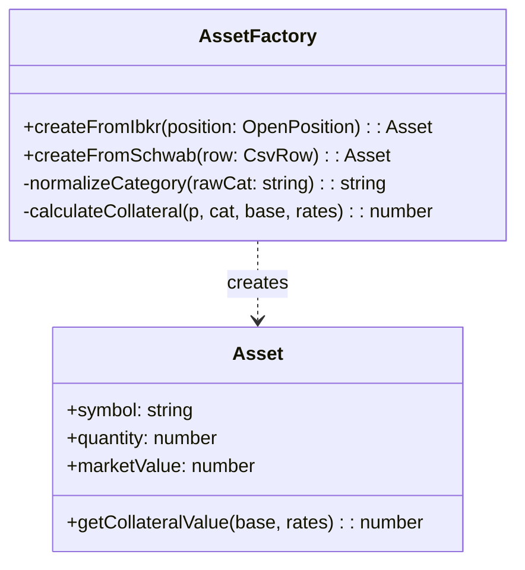
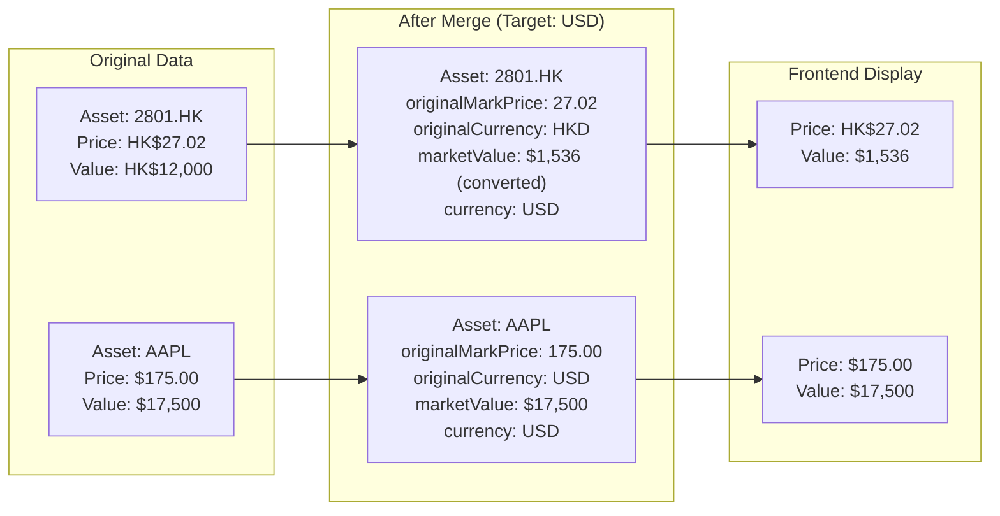
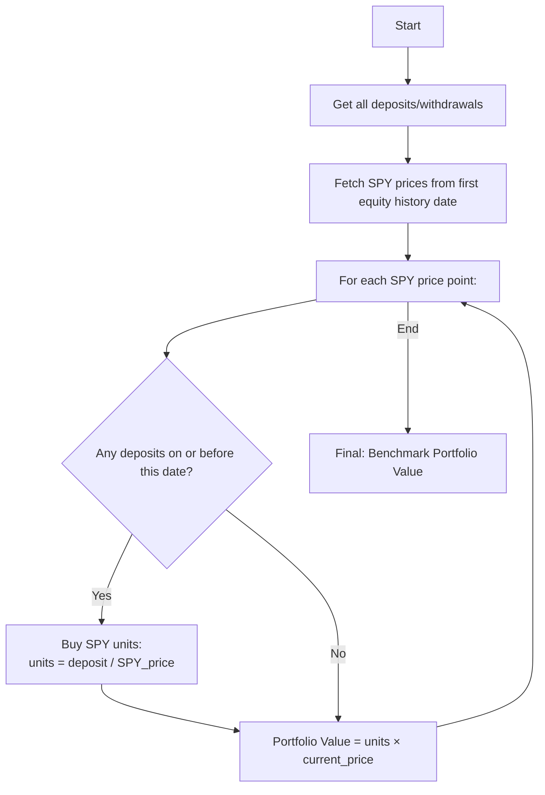

# BeatTheMarket Architecture Documentation

## Table of Contents
1. [Overview](#overview)
2. [High-Level Architecture](#high-level-architecture)
3. [Data Flow Pipeline](#data-flow-pipeline)
4. [Core Abstractions](#core-abstractions)
5. [Module Reference](#module-reference)
6. [Key Design Patterns](#key-design-patterns)
7. [Currency Handling](#currency-handling)
8. [Benchmark Calculation](#benchmark-calculation)
9. [Extensibility Guide](#extensibility-guide)
10. [Refactoring Summary](#refactoring-summary)

---

## Overview

BeatTheMarket is a portfolio tracking and benchmarking application that helps investors answer: **"Am I beating the market?"**

The backend architecture was designed with these principles:
- **Data Source Agnostic**: The calculation engine doesn't know or care where data comes from
- **Multi-Currency Native**: All values can be normalized to any target currency
- **Extensible**: New data providers can be added without modifying core logic

---

## High-Level Architecture



---

## Data Flow Pipeline

The data flows through the system in distinct phases:



---

## Core Abstractions

### 1. PortfolioProvider (Strategy Pattern)

**Location**: `src/core/types/index.ts`

Defines the contract for any data source. Each provider knows how to parse its specific input format into a standardized `UnifiedPortfolio`.

```typescript
interface PortfolioProvider {
    name: string;
    parse(input: string): UnifiedPortfolio;
}
```

**Current Implementations**:
- `IbkrProvider` ([ibkr-provider.ts](file:///Users/raynergoh/BeatTheMarket/src/core/parser/ibkr-provider.ts))

### Unified Code Paths

Both data ingestion methods use **identical parsing logic**:

| Method | Code Path |
|--------|-----------|
| **Token ID (Live Sync)** | `ibkrProvider.parse(xmlData)` |
| **Manual XML Upload** | `IbkrProvider.fromParsedReport(jsonData)` |

Both methods internally use the shared `mapToUnified()` method to ensure consistency:

```typescript
class IbkrProvider {
    // For live XML from Flex Query
    parse(xmlContent: string): UnifiedPortfolio {
        const report = parseFlexReport(xmlContent);
        return IbkrProvider.mapToUnified(report, 'IBKR');
    }
    
    // For JSON from localStorage (manual upload)
    static fromParsedReport(report: ParsedFlexReport): UnifiedPortfolio {
        return IbkrProvider.mapToUnified(report, 'IBKR-Manual');
    }
    
    // Shared core logic - both methods use this
    private static mapToUnified(report, label): UnifiedPortfolio { ... }
}
```

> **Key Design Decision**: The `cashBalance` field is set to `0` in `mapToUnified()` because cash holdings are already included as individual CASH assets in the `assets` array. This prevents double-counting in net worth calculations.

### 2. Asset Interface

**Location**: `src/core/types/index.ts`

Represents a normalized position regardless of the source broker.

```typescript
interface Asset {
    symbol: string;
    description?: string;
    assetClass: string;              // 'STOCK', 'OPTION', 'CASH'
    quantity: number;
    marketValue: number;             // In target currency after merge
    currency: string;                // Target currency
    originalCurrency?: string;       // Native currency before conversion
    costBasis?: number;
    originalMarkPrice?: number;      // Per-share price in native currency
    originalCostBasisPrice?: number; // Per-share cost in native currency
    
    // Behavioral method
    getCollateralValue(baseCurrency: string, fxRates: Map<string, number>): number;
}
```

**Key Design Decision**: Per-share prices (`originalMarkPrice`, `originalCostBasisPrice`) are preserved in native currency for display, while total values (`marketValue`, `costBasis`) are converted to target currency for calculations.

---

### 3. UnifiedPortfolio

**Location**: `src/core/types/index.ts`

The normalized output from any provider. Contains everything needed for analysis.

```typescript
interface UnifiedPortfolio {
    assets: Asset[];
    cashBalance: number;
    baseCurrency: string;
    transactions: CashTransaction[];
    equityHistory: Array<{ date: string; nav: number }>;
    cashFlows: Array<{
        date: string;
        amount: number;
        type: 'DEPOSIT' | 'WITHDRAWAL';
        currency: string;
        originalAmount?: number;
        originalCurrency?: string;
    }>;
    metadata: {
        provider: string;
        asOfDate: string;
        accountId?: string;
    };
}
```

---

### 4. AssetFactory (Factory Pattern)

**Location**: `src/core/parser/asset-factory.ts`

Transforms raw broker positions into standardized `Asset` objects with behavioral methods.

```typescript
class AssetFactory {
    static createFromIbkr(position: OpenPosition): Asset {
        // 1. Normalize asset category
        // 2. Preserve original prices
        // 3. Attach collateral calculation method
        return { ...normalizedAsset, getCollateralValue: () => {...} };
    }
}
```

**Responsibilities**:
- Category normalization: `'OPT'` → `'OPTION'`, `'STK'` → `'STOCK'`
- Preserve original per-share prices for display
- Encapsulate collateral calculation logic

---

### 5. PortfolioMerger

**Location**: `src/core/utils/portfolio-merger.ts`

Combines multiple `UnifiedPortfolio` objects (e.g., from multiple accounts) into one, with FX conversion.



**Key Features**:
- **Fill-Forward Equity History**: If one account has sparse NAV data, the merger fills gaps using the last known value
- **Transfer Deduplication**: Internal transfers between accounts are identified and netted to avoid double-counting
- **Preserve Original Values**: Per-share prices are NOT converted (preserved for display)

---

## Module Reference

### Parser Layer (`src/core/parser/`)

| File | Purpose |
|------|---------|
| [ibkr-provider.ts](file:///Users/raynergoh/BeatTheMarket/src/core/parser/ibkr-provider.ts) | IBKR implementation of `PortfolioProvider` |
| [ibkr-logic.ts](file:///Users/raynergoh/BeatTheMarket/src/core/parser/ibkr-logic.ts) | Low-level XML parsing functions |
| [asset-factory.ts](file:///Users/raynergoh/BeatTheMarket/src/core/parser/asset-factory.ts) | Creates standardized `Asset` objects |
| [cash-flows.ts](file:///Users/raynergoh/BeatTheMarket/src/core/parser/cash-flows.ts) | Extracts and categorizes cash transactions |
| [transfers.ts](file:///Users/raynergoh/BeatTheMarket/src/core/parser/transfers.ts) | Internal transfer detection logic |
| [index.ts](file:///Users/raynergoh/BeatTheMarket/src/core/parser/index.ts) | Convenience re-exports |

---

### Engine Layer (`src/core/engine/`)

| File | Purpose |
|------|---------|
| [benchmark.ts](file:///Users/raynergoh/BeatTheMarket/src/core/engine/benchmark.ts) | "What-If" SPY comparison calculation |
| [currency.ts](file:///Users/raynergoh/BeatTheMarket/src/core/engine/currency.ts) | FX rate utilities with lookback |

---

### Utility Layer (`src/core/utils/`)

| File | Purpose |
|------|---------|
| [portfolio-merger.ts](file:///Users/raynergoh/BeatTheMarket/src/core/utils/portfolio-merger.ts) | Multi-account merging with FX |

---

### API Layer (`app/api/portfolio/`)

| File | Purpose |
|------|---------|
| [route.ts](file:///Users/raynergoh/BeatTheMarket/app/api/portfolio/route.ts) | Main API endpoint orchestrating all operations |

---

## Key Design Patterns

### 1. Strategy Pattern (Data Providers)

Allows different data sources without changing core logic.



---

### 2. Factory Pattern (Asset Creation)

Encapsulates the complexity of creating normalized assets from raw data.



---

### 3. Pipeline Pattern (Data Transformation)

Data flows through discrete, testable transformation stages.

```
Raw Input → Parse → Normalize → Convert FX → Merge → Analyze → Respond
```

---

## Currency Handling

### Multi-Currency Flow



**Key Insight**: Per-share prices use `originalCurrency` for display, while totals use the target currency.

---

### FX Rate Lookback

When fetching historical FX rates, some dates may be missing (weekends, holidays). The system uses a lookback strategy:

```typescript
function getRateWithLookback(map: Map<string, number>, date: string, days = 5): number {
    // 1. Check exact date
    // 2. Look back up to 5 days
    // 3. Fall back to fill-forward (last known rate)
    return rate;
}
```

---

## Benchmark Calculation

The benchmark answers: **"What if I had invested all my deposits in SPY instead?"**

### Algorithm



### Key Design Decisions

1. **Start Date**: Uses first equity history date (when portfolio was tracked), not first deposit date
2. **Pure Deposits**: Only uses actual deposits/withdrawals, no synthetic adjustments
3. **SPY in Target Currency**: SPY prices are converted to user's selected currency for comparison

---

## Extensibility Guide

### Adding a New Data Provider

1. **Create the provider file**:
   ```
   src/core/parser/schwab-provider.ts
   ```

2. **Implement the interface**:
   ```typescript
   import { PortfolioProvider, UnifiedPortfolio } from '../types';
   import { AssetFactory } from './asset-factory';

   export class SchwabProvider implements PortfolioProvider {
       name = 'Schwab';

       parse(csvContent: string): UnifiedPortfolio {
           // 1. Parse CSV
           const rows = this.parseCsv(csvContent);
           
           // 2. Create assets (extend AssetFactory if needed)
           const assets = rows.map(row => AssetFactory.createFromSchwab(row));
           
           // 3. Extract cash flows and equity history
           const cashFlows = this.extractCashFlows(rows);
           const equityHistory = this.extractEquityHistory(rows);
           
           // 4. Return UnifiedPortfolio
           return {
               assets,
               cashFlows,
               equityHistory,
               // ... other fields
           };
       }
   }
   ```

3. **Extend AssetFactory** (if needed):
   ```typescript
   // In asset-factory.ts
   static createFromSchwab(row: SchwabRow): Asset {
       return {
           symbol: row.symbol,
           quantity: parseFloat(row.quantity),
           marketValue: parseFloat(row.value),
           // ...
       };
   }
   ```

4. **Register in route.ts**:
   ```typescript
   // In app/api/portfolio/route.ts
   if (body.provider === 'schwab') {
       const provider = new SchwabProvider();
       portfolios.push(provider.parse(body.csvContent));
   }
   ```

---

### Adding a New Metric

To add a new calculation (e.g., Sharpe Ratio):

1. **Create engine file**:
   ```
   src/core/engine/sharpe.ts
   ```

2. **Implement calculation**:
   ```typescript
   import { UnifiedPortfolio } from '../types';

   export function calculateSharpeRatio(
       portfolio: UnifiedPortfolio,
       riskFreeRate: number = 0.04
   ): number {
       // Calculate using equityHistory
       const returns = calculateReturns(portfolio.equityHistory);
       const avgReturn = mean(returns);
       const stdDev = standardDeviation(returns);
       return (avgReturn - riskFreeRate) / stdDev;
   }
   ```

3. **Expose in API**:
   ```typescript
   // In route.ts
   const sharpeRatio = calculateSharpeRatio(unified);
   return NextResponse.json({ ..., sharpeRatio });
   ```

---

## Refactoring Summary

### Before Refactoring
- Monolithic `lib/ibkr-parser.ts` handling parsing AND calculations
- Tight coupling between IBKR XML format and calculation logic
- Hardcoded currency assumptions
- Synthetic collateral adjustment inflating benchmark

### After Refactoring

| Aspect | Before | After |
|--------|--------|-------|
| **Architecture** | Monolithic | Layered (Parser → Engine → API) |
| **Data Sources** | IBKR only | Extensible via `PortfolioProvider` |
| **Currency** | USD-centric | Multi-currency native |
| **Asset Creation** | Inline logic | `AssetFactory` pattern |
| **Merging** | Ad-hoc | `PortfolioMerger` with FX |
| **Benchmark** | Complex with collateral | Simple deposit-based |
| **Testing** | Limited | Unit tests for core logic |

### Files Changed/Created

**New Files**:
- `src/core/types/index.ts` - Core type definitions
- `src/core/parser/ibkr-provider.ts` - IBKR provider
- `src/core/parser/asset-factory.ts` - Asset creation factory
- `src/core/parser/cash-flows.ts` - Cash flow extraction
- `src/core/parser/transfers.ts` - Transfer handling
- `src/core/engine/benchmark.ts` - Benchmark calculation
- `src/core/engine/currency.ts` - Currency utilities
- `src/core/utils/portfolio-merger.ts` - Portfolio merging
- `src/core/constants/index.ts` - Shared constants

**Refactored Files**:
- `app/api/portfolio/route.ts` - Orchestration using new modules
- `lib/ibkr-parser.ts` → Now re-exports from `src/core/parser`

---

## Testing

### Running Tests
```bash
npm test
```

### Test Coverage

| File | Tests |
|------|-------|
| `lib/finance/fx-rates.test.ts` | FX rate fetching |
| `lib/ibkr-parser.test.ts` | XML parsing |
| `tests/edge-cases.test.ts` | Edge case fuzzing |
| `tests/core-logic.test.ts` | Core calculation logic |
| `tests/dashboard-integration.test.tsx` | Component integration |

---

## Future Enhancements

1. **Additional Providers**: Schwab CSV, Plaid API, Manual CSV upload
2. **Performance Metrics**: Sharpe Ratio, Max Drawdown, CAGR
3. **Custom Benchmarks**: Compare against QQQ, VTI, or custom indices
4. **Tax Lot Tracking**: FIFO/LIFO cost basis
5. **Dividend Tracking**: Reinvestment analysis
